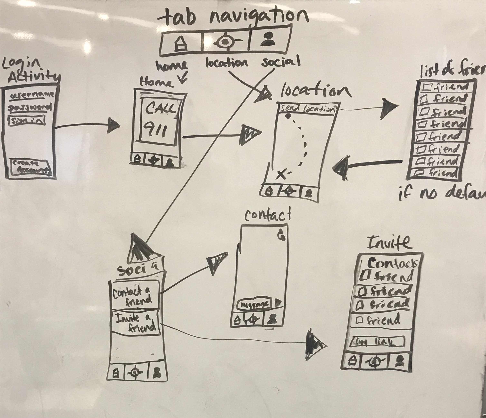

Group Project - README Template
===

# The Nightwalker

## Table of Contents
1. [Overview](#Overview)
1. [Product Spec](#Product-Spec)
1. [Wireframes](#Wireframes)
2. [Schema](#Schema)

## Overview
### Description
The Nightwalker app is a security app that enables users to call 911 emergency line, and communicate your friends and family. It allows security officials and family members to get your location.

### App Evaluation
[Evaluation of your app across the following attributes]
- **Category:** Lifestyle & Security
- **Mobile:** Website is interactive and uses a users phone call functionality to contact police and location information.
- **Story:** We want to provide a way for college students around the country to feel safe, even when in unsafe situations.
- **Market:** College Students
- **Habit:** User can immediately call 911 upon opening the app or they can choose to use GPS or ask friends for a walk around campus/the surrounding area. Choosing GPS will allow the user to see their location and send their location to friends.
- **Scope:** The NightWalker will enable users call 911 in case of emergency situations. Users can invite a friend to be a night walker with whom the user shares their current location.

## Product Spec

### 1. User Stories (Required and Optional)

**Required Must-have Stories**

* Signup and Login
* Emergency calls to 911
* GPS
* Invite a friend as a Night Walker
* 

**Optional Nice-to-have Stories**

* OAuth
* Great UI design
* Share location with NighWalker
* Track my location
* Recorded voice instead of calling 911 to send location
* ...

### 2. Screen Archetypes

* Login Screen
   * Sign up for our services
   * Login to account
* Home Screen
   * Bottom navigation for GPS and Social
   * Alert the authorities button
* Track my location / Social Screen
    * Shows a map
    * Has function to send location to friends
    * Has a track location function where friends can track your progress to the destination
    * Invite friends
    * Message friends for escorts across campus

### 3. Navigation

**Tab Navigation** (Tab to Screen)

* Home
* Track my location
* Social 
 

**Flow Navigation** (Screen to Screen)

* Forced Login/Account Creation
* Home Page with Call 911
* Track my location -> Jumps to Location
* Social -> Jumps to chat

## Wireframes
[The NightWalker App WireFrame]

### [BONUS] Digital Wireframes & Mockups

### [BONUS] Interactive Prototype

## Schema 

### Models
## Model: Users
| **Property Name** | **Type**            | **All tasks*          |
|:----------------- |:------------------- |:--------------------- |
| username          | pointer to username | user's username       |
| profile avatar    | image               | user's profile avatar |
| password          | string              | user's password       |
| Location          | pointer to Location | user's location       |

## Model: Location 
| **Property Name**| **Type**            | **All tasks*
| :----------------| :-------------------| :---------------------|
| Latitude         |    string           | number and direction of latitude|
| Longitude        |    string           | number and direction of longitude |

## Model: Message
| **Property Name**| **Type**            | **All tasks*          |
| :----------------| :-------------------| :---------------------|
|objectId          |  Pointer             | unique id for the current user                       |
| author           | Pointer              | author of the message                       |
| createdAt        | Date/Time            | Date/time message was sent                       |
## FriendsList
| **Property Name** | **Type**       | **All tasks* |
|:----------------- |:--------       |:------------ |
| priority          |number          |The order of priority of the contacted people            |
| phone number      |number          |The phone numbers of all contacts              |
| relationship      |string          |specifies relationship to highly ranked contacts              |

### Networking

| **Screen**      | HTTP VERB   | **Network requests**                   |
|:--------------- | ---         |:-------------------------------------- |
| Login           |POST         | post user's username and password            |
| Home            |POST         | making a call to police               |
| Location        |GET          | reading the user's location                   |
| List of Friends |GET          | getting contacts                           |
| Contact         |POST         | CREATE a new message                   |
| Invite          |GET          | reads and gets user's contact and select |

- [Add list of network requests by screen ]
- [Create basic snippets for each Parse network request]

## POST REQUEST

### GET REQUEST

 public static void makeRequest(Context context) {
    RequestQueue queue = Contacts.newRequestQueue(context);

    Response.Listener responseListener = new Response.Listener<String>() {
        @Override
        public void onResponse(String contact) {
            if (response!=null){
                Log.d("Contact", contact);
                
            }
        }
    };

